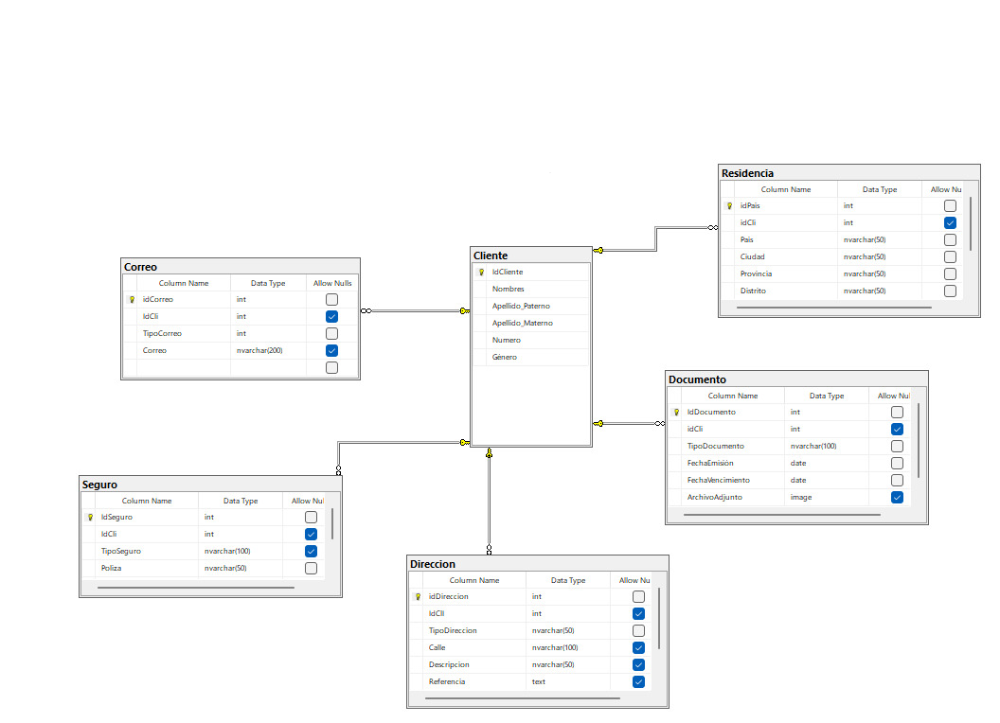

# GRUPO DE  5 ESTUDIANTES

# INTEGRANTES : JOSE LUIS JARRO C. , Jean Valverde  Zamora  ,Jhonny Rivera Mendoza , Anthoy Cano Sucso, Josue Abraham Chambilla Zuñiga

# Gestion de Clientes

# C# --- SQL SERVER 2019  ---OR/M ---DOCKER ---DOCUMENTACION TECNICA GITHUB

## OBJETIVOS
  * Realizar el proyecto de Gestion de clientes, con los conocimientos realizados aprendidos  

## REQUERIMIENTOS

  * Resumen (de 10 a 15 líneas)

  * Abstract

  * Antecedentes o introducción

  * Titulo

  * Autores

  * Planteamiento del problema

           * 4.1.   Problema

           * 4.2.   Justificación

           * 4.3.   Alcance

  * Objetivos

  * 5.1.   General

  * 5.2.   Específicos

  * 6. Desarrollo de la propuesta 

  * 6.1. Diagramas de Casos de Uso

   

  * 6.2. Diagrama de Clases

  * 6.3. Diagrama de Componentes

  * 6.4. Arquitectura.

  * 6.5. Diagrama de Base de Datos

  * 7 Bibliografia

    

      

    

  * 8 Anexos

  * 8.1 Diccionario de datos de su base de datos relacional

  * Tablas, con los siguientes campos: 

  * Nombre de Columna | Descripción | Tipo de Dato | Permite nulos | Constraint | Default

  * 8.2. Estandar de Programacion, tomar el siguiente ejemplo (adjunto)

## CONSIDERACIONES INICIALES
  * Clonar el repositorio mediante git para tener los recursos necesarios

## DESARROLLO

# Resumen  

Este informe presenta el desarrollo de una aplicación de Gestión de Clientes utilizando C# como lenguaje de programación 
y Microsoft SQL Server como base de datos relacional. La aplicación incluye funcionalidades de registro de clientes, 
seguimiento de pedidos y gestión de información de clientes. El objetivo principal es mejorar 
la eficiencia en la atención al cliente y el seguimiento de pedidos.

# Abstarct  

This report presents the development of a Customer Management application using C# as the programming language and Microsoft SQL 
Server as the relational database. The application includes features for customer registration, order tracking,
and customer information management. The main objective is to enhance customer service efficiency and order tracking.
 
# Antecedente s o Introduccion  
La gestión eficiente de clientes es fundamental para cualquier empresa.
 La aplicación de Gestión de Clientes busca automatizar y mejorar 
 los procesos relacionados con la atención al cliente y el seguimiento de pedidos.

# Titulo  
Desarrollo de una Aplicación de Gestión de Clientes en C# y SQL Server.

# Autores  

- Jose Luis Jarro C.
- Jean Valverde Zamora  
- Anthony Cano Sucso  
- Josue Chmabilla Zuñiga  
- Jhony Rivera  Mendoza  

# Planteamiento del Problema  
  * Problema 
   - Las empresas enfrentan desafíos en la gestión de clientes y pedidos, lo que puede llevar a retrasos en la atención al cliente y pérdida de información importante.

  * Justificacion 

  - La implementación de una aplicación de Gestión de Clientes ayudará a resolver los problemas identificados y mejorar la eficiencia en la atención al cliente.

  * Alcance  

  - La aplicación cubrirá las funciones básicas de gestión de clientes, registro de pedidos y seguimiento de pedidos.

# Objetivos  
   
  * General  
  - Desarrollar una aplicación de Gestión de Clientes que mejore la eficiencia en la atención al cliente.

  * Especificos 
   
   - Diseñar e implementar la interfaz de usuario.
   - Crear una base de datos SQL Server para almacenar información de clientes y pedidos.
   - Desarrollar funciones de registro de clientes y seguimiento de pedidos.
   - Implementar un sistema de autenticación de usuarios.

# Desarrollo de la Propuesta

# Diagramas  
- Diagramas de Casos de Uso.

  

- Diagrama de Clases.
  
  
  
  
  
- Diagrama de Componentes.

# Arquitectura
- Diagrama de Arquitectura
  

# Diagrama de Base de Datos

   

# Diagrama de Componentes

   

# Bibliografía

- Acosta, R. (n.d.). Swagger - Cómo documentar servicios Web API de ASP.NET Core. https://www.rafaelacosta.net/Blog/2019/7/8/swagger-c%c3%b3mo-documentar-servicios-web-api-de-aspnet-core? 
      AspxAutoDetectCookieSupport=1
  

# Diccionario de Datos de la Base de Datos Relacional

# Estándar de Programación
